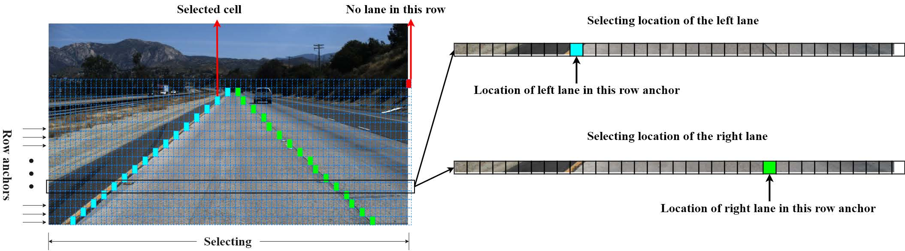

## 坐标转换说明 （以tusimple为例）
<br>
  
<br>  

- ANCHORS  

    从图片底部开始选取ROW ANCHORS[本例为56个]，图片的 高度被归一化到 h=<font color=red>288</font>,w=<font color=red>800</font>
    ```python
        ROW_ANCHOR_H288 = [64, 68, 72, 76, 80, 84, 88, 92, 96, 100, 104, 108, 112,
                       116, 120, 124, 128, 132, 136, 140, 144, 148, 152, 156, 160, 164,
                       168, 172, 176, 180, 184, 188, 192, 196, 200, 204, 208, 212, 216,
                       220, 224, 228, 232, 236, 240, 244, 248, 252, 256, 260, 264, 268,
                       272, 276, 280, 284]
    ```
  

- GIRD NUMS  
  把图片的宽等分成 grid nums=100
  

## 数据标注转换说明  

```python
def create_mask(in_path, out_path):
    """
    生成皮带边缘mask, 不支持水平方向的线

    Args
        in_path: 使用 x-anylabel 标注的折线数据 (jpg, json) 标签从 1 开始
        out_path
    """
    os.makedirs(out_path, exist_ok=True)
    out_weight = f'{out_path}-weight'
    os.makedirs(out_weight, exist_ok=True)

    json_names = [name for name in os.listdir(in_path) if name.endswith('json')]
    for name in tqdm.tqdm(json_names):

        with open(f'{in_path}/{name}', mode='r') as f:
            anns = json.load(f)

        tmp = dict()
        flip = ''
        for shape in anns['shapes']:
            label = int(shape['label'])
            if flip == '':
                # 如果需要旋转90度,所有的皮带都会旋转90度
                flip = shape['description']
            if tmp.get(label, None) is None:
                tmp[label] = list()
            tmp[label].extend(shape['points'])

        arr = name.split('.')
        img = cv2.imread(f'{in_path}/{arr[0]}.jpg', cv2.IMREAD_GRAYSCALE)

        shapes = dict()
        for k, pts in tmp.items():
            shapes[k] = sorted(pts, key=lambda xy: xy[1], reverse=False)

        del tmp

        mask_name = f'{out_path}/{arr[0]}.png'

        mask = np.zeros_like(img)
        offset_base = 20
        labels = list(shapes.keys())
        for label, points in shapes.items():
            """
            皮带边缘标签 依次是 1, 2, 3, 4, ... 
            1, 2 是一个皮带, 3, 4 是一个皮带
            扩张的时候 往皮带内部扩张  
            通过两个皮带边缘的距离来确定offset的大小,防止在远处两个皮带边缘沾连
            """
            if label % 2 == 0:  # 是偶数 则往右边扩张
                offset = -offset_base
            else:  # 是奇数则往左阔边扩张
                offset = offset_base

            if label % 2 == 1:  # 是奇数 则和它同属一条皮带的label = label + 1
                nb_label = label + 1
            else:
                nb_label = label - 1

            back_multi = 5
            if nb_label not in labels:
                back_multi = 10
                if (label - 1) // 2 == 0:
                    """
                    如果是1,2 则让3, 4 作为邻居
                    否则 1, 2 做为邻居
                    """
                    if 3 in labels:
                        nb_label = 3
                    elif 4 in labels:
                        nb_label = 4
                else:
                    if 2 in labels:
                        nb_label = 2
                    elif 1 in labels:
                        nb_label = 1

            nb_points = shapes.get(nb_label, None)
            if nb_points is not None:
                nb_k, nb_b = polyfit(nb_points)

                front_x = points[-1][0]
                back_x = points[0][0]

                if nb_k is None:
                    nb_front_x = shapes[nb_label][-1][0]
                    nb_back_x = shapes[nb_label][0][0]
                else:
                    nb_front_x = (points[-1][1] - nb_b) / nb_k
                    nb_back_x = (points[0][1] - nb_b) / nb_k

                back_offset = abs(back_x - nb_back_x)
                front_offset = abs(front_x - nb_front_x)

                if back_offset <= abs(offset * back_multi) or front_offset > back_offset * 5:
                    back_y = back_offset / front_offset
                    front_y = 1

                    if front_x != back_x:
                        k = (front_y - back_y) / (front_x - back_x)
                        b = front_y - front_x * k
                    else:
                        k = 0
                        b = 1

                    in_pts = [[pt[0] + offset * (k * pt[0] + b), pt[1]] for pt in points]
                    in_pts = in_pts[::-1]
                    pts = points + in_pts
                else:
                    in_pts = [[pt[0] + offset, pt[1]] for pt in points]
                    in_pts = in_pts[::-1]
                    pts = points + in_pts

                pts = np.asarray(pts, dtype=np.int32)
            else:
                in_pts = [[pt[0] + offset, pt[1]] for pt in points]
                in_pts = in_pts[::-1]
                pts = points + in_pts

                pts = np.asarray(pts, dtype=np.int32)
            """
            不要用 LINE_AA, 他会使用高斯模糊， 当label超过1时，边缘的值会被模糊 不等于label
            """
            # cv2.polylines(mask, [pts], isClosed=False, color=label, thickness=4, lineType=cv2.LINE_8)
            cv2.fillPoly(mask, [pts], color=label, lineType=cv2.LINE_8)

        cv2.imwrite(mask_name, mask)

        img = cv2.imread(f'{in_path}/{arr[0]}.jpg', cv2.IMREAD_COLOR)
        for label in np.unique(mask):
            if label == 0:
                continue
            b, g, r = COLORS[label]
            img[:, :, 0] = np.where(mask == label, b, img[:, :, 0])
            img[:, :, 1] = np.where(mask == label, g, img[:, :, 1])
            img[:, :, 2] = np.where(mask == label, r, img[:, :, 2])

        cv2.imwrite(f'{out_weight}/{arr[0]}_weight.jpg', img)

    return
```